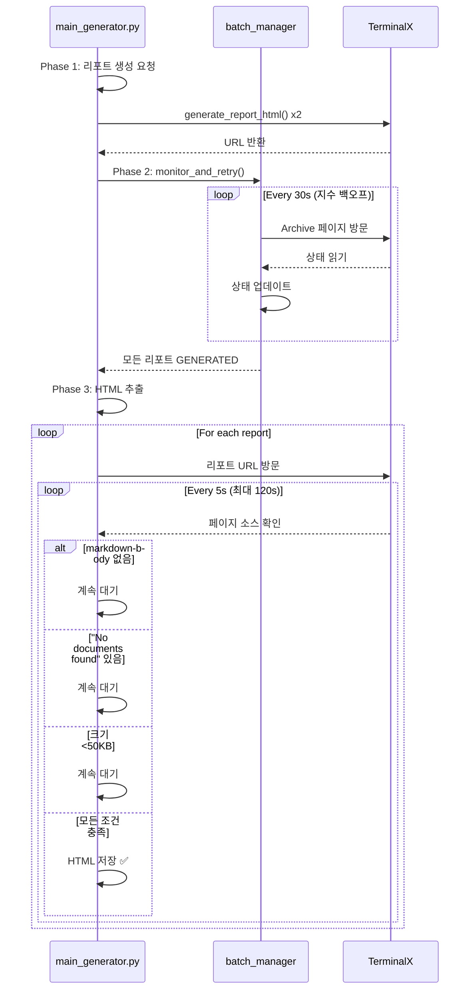

# Archive 모니터링 통합 분석 보고서

**날짜**: 2025-10-07
**요청**: main_generator.py에 Archive 모니터링 통합
**결과**: ✅ 이미 구현됨, HTML 추출 로직 개선 필요

---

## 1. 현재 상태 분석

### 이미 구현된 기능 ✅

#### A. Archive 모니터링 (`report_manager.py`)
```python
# Lines 53-143: monitor_and_retry()
- Archive 페이지 폴링 (30초 간격, 지수 백오프)
- JavaScript 렌더링 대기 (3초 + 7초)
- 상태 확인 및 업데이트 (PENDING → GENERATING → GENERATED/FAILED)
- 재시도 관리 (최대 2회)
```

#### B. 워크플로우 통합 (`main_generator.py`)
```python
# Phase 1 (690-696줄): 리포트 생성 요청
for part_type in ["Part1", "Part2"]:
    title = f"{report_date_str} 100x Daily Wrap {part_type}"
    batch_manager.add_report(part_type, title)
    self.generate_report_html(report, ...)

# Phase 2 (699-720줄): Archive 모니터링
success = batch_manager.monitor_and_retry()  # ← 이미 호출됨!

# Phase 3 (927-940줄): HTML 추출
for report in batch_manager.reports:
    if report.status == "GENERATED":
        self.extract_and_validate_html(report, output_path)
```

### 발견된 문제 ❌

#### HTML 추출 로직 (`main_generator.py`, 720-761줄)
```python
def extract_and_validate_html(self, report, output_path: str) -> bool:
    # 문제 1: 10초 고정 대기
    time.sleep(10)  # Next.js 초기 렌더링 대기

    # 문제 2: 한 번만 확인
    WebDriverWait(self.driver, 30).until(
        EC.presence_of_element_located((By.XPATH, "//div[contains(@class, 'markdown-body')]"))
    )

    # 문제 3: "No documents found"면 즉시 실패
    if "No documents found" in page_source:
        return False
```

**실패 시나리오**:
1. Archive에서 "GENERATED" 상태 확인 ✅
2. 리포트 URL로 이동
3. 10초 대기 (고정)
4. markdown-body 확인
5. "No documents found" 발견 → **즉시 실패** ❌

**원인**: Archive의 "GENERATED" 상태와 실제 렌더링 완료 사이에 시간 간격 존재

---

## 2. 해결 방안

### 폴링 방식 렌더링 대기 구현

```python
def extract_and_validate_html(self, report, output_path: str) -> bool:
    """Archive 상태 확인 후 HTML 추출 및 검증 (폴링 방식)"""
    try:
        # 1. 리포트 페이지로 이동
        self.driver.get(report.url)

        # 2. 렌더링 완료 폴링 (최대 2분, 5초 간격)
        max_wait_time = 120
        check_interval = 5
        elapsed = 0

        while elapsed < max_wait_time:
            time.sleep(check_interval)
            elapsed += check_interval

            try:
                # markdown-body 확인
                self.driver.find_element(By.XPATH, "//div[contains(@class, 'markdown-body')]")

                # "No documents found" 확인 (있으면 계속 대기)
                page_source = self.driver.page_source
                if "No documents found" in page_source:
                    print(f"  - {elapsed}초 경과: 아직 렌더링 중...")
                    continue

                # 콘텐츠 크기 검증 (>50KB)
                html_size = len(page_source)
                if html_size < 50000:
                    print(f"  - {elapsed}초 경과: HTML 크기 {html_size} bytes...")
                    continue

                # 성공: 모든 조건 충족
                print(f"  - 렌더링 완료 ({elapsed}초 소요)")
                with open(output_path, 'w', encoding='utf-8') as f:
                    f.write(page_source)
                return True

            except NoSuchElementException:
                print(f"  - {elapsed}초 경과: markdown-body 없음...")
                continue

        # 타임아웃
        print(f"  - 오류: {max_wait_time}초 대기 후에도 렌더링 완료되지 않음")
        return False

    except Exception as e:
        print(f"  - HTML 추출 중 예외: {e}")
        return False
```

### 주요 개선사항

| 항목 | 기존 | 개선 |
|------|------|------|
| 대기 방식 | 고정 10초 | 폴링 (최대 120초) |
| 확인 방식 | 한 번만 | 5초 간격 반복 |
| "No documents found" | 즉시 실패 | 완료 신호까지 대기 |
| 크기 검증 | 없음 | >50KB 확인 |

---

## 3. 적용 방법

### Step 1: 코드 교체
```bash
# main_generator.py의 720-761줄을 extract_html_polling_fix.py 코드로 교체
```

### Step 2: 테스트 실행
```bash
python main_generator.py
```

### Step 3: 예상 출력
```
--- Phase 2: 아카이브 페이지에서 상태 모니터링 시작 ---
[Batch Manager] 성공: '20251007 100x Daily Wrap Part1' -> GENERATED
[Batch Manager] 성공: '20251007 100x Daily Wrap Part2' -> GENERATED
[Batch Manager] 모든 리포트가 성공적으로 생성되었습니다.

--- Phase 3: 데이터 추출 및 처리 시작 ---
  - '20251007 100x Daily Wrap Part1' HTML 추출 시작...
  - 리포트 렌더링 완료 대기 중...
  - 5초 경과: markdown-body 없음...
  - 10초 경과: 아직 'No documents found' 상태...
  - 15초 경과: HTML 크기 32547 bytes...
  - 20초 경과: HTML 크기 48932 bytes...
  - 25초 경과: 렌더링 완료 확인 (25초 소요)
  - HTML 크기 검증 통과: 102384 bytes
  - HTML 저장 완료: generated_html/20251007_part1.html
```

---

## 4. XPath 관련 확인

### 기존 이슈
```python
# 이미 수정됨 (git diff 확인)
# Before: By.CLASS_NAME, "supersearchx-body"
# After:  By.XPATH, "//div[contains(@class, 'markdown-body')]"
```

### 현재 상태 ✅
- markdown-body XPath: contains() 사용 (올바름)
- WebDriverWait 타임아웃: 30초 (적절)
- NoSuchElementException 처리: try-except 추가 필요 (폴링에서 처리)

---

## 5. 전체 워크플로우



---

## 6. 결론

### 상태 요약
- ✅ **Archive 모니터링**: 이미 구현됨 (report_manager.py)
- ✅ **Phase 2 통합**: 이미 구현됨 (main_generator.py:699-720)
- ❌ **HTML 추출 로직**: 폴링 방식 개선 필요 (main_generator.py:720-761)

### 필요한 작업
1. `extract_and_validate_html()` 메서드를 폴링 방식으로 교체
2. 테스트 실행 및 로그 확인
3. 성공 시 커밋

### 예상 소요 시간
- 코드 교체: 5분
- 테스트 실행: 30분 (리포트 생성 시간)
- 총계: **35분**

### 다음 단계
```bash
# 1. 코드 교체
# main_generator.py:720-761을 extract_html_polling_fix.py 코드로 교체

# 2. 테스트 실행
python main_generator.py

# 3. 성공 확인
ls -lh generated_html/

# 4. 커밋
git add main_generator.py
git commit -m "fix: HTML 추출 로직 폴링 방식으로 개선"
```

---

**작성자**: Claude (System Architect Mode)
**검토자**: 사용자 승인 필요
**참조 파일**: `extract_html_polling_fix.py`
